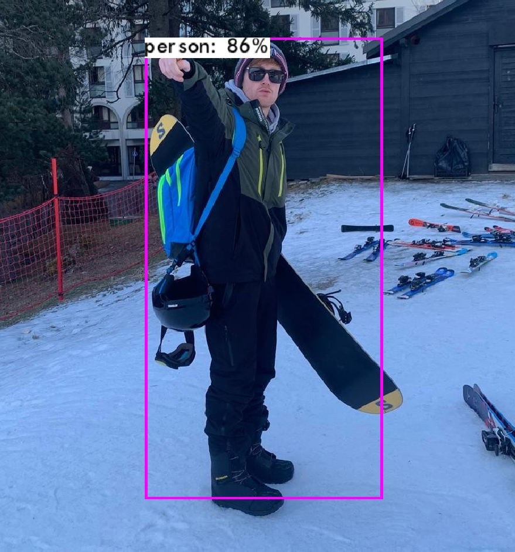

# yolov3 in mlpack



Implementation of the yolov3 family of models in mlpack.

## Features

## Requirements

requires arma15(or master?) (repcube)

## Example

Here's an example of running `yolov3-tiny` in ~30 lines. Download weights [here](https://drive.google.com/drive/folders/1BiACM5LxcD1m3wkutQ8GtVesWXfSCdeK). You can compile it with `g++ example.cpp -O3 -o example -larmadillo`.

```cpp
#include "./yolov3/serialization.hpp"
#include "./yolov3/image.hpp"
#include "./yolov3/boundingbox.hpp"
#include "./yolov3/labels.hpp"

using namespace mlpack;

int main() {
  const std::string inputFile = "./images/giraffe.jpg";
  const std::string outputFile = "./giraffe.jpg";
  const size_t imgSize = 416;
  const size_t numBoxes = 2535; // 2535, 6300, 10647, 22743
  const double ignoreThresh = 0.7;

  DAGNetwork<EmptyLoss, RandomInitialization, arma::fmat> model;
  data::Load("./weights/mlpack/yolov3-tiny.bin", "yolov3-tiny", model);

  Image image;
  Image input(imgSize, imgSize, 3);
  LoadImage(inputFile, image);
  LetterBox(image, input);

  arma::fmat detections;
  model.Predict(input.data, detections);

  auto alphabet = GetAlphabet("./data/labels");
  auto labels = GetLabels("./data/coco.names", 80); // 80 for coco

  DrawBoxes(detections, numBoxes, ignoreThresh, 4, imgSize, 1.5, labels, alphabet, image);
  SaveImage(outputFile, image);
  return 0;
}
```
